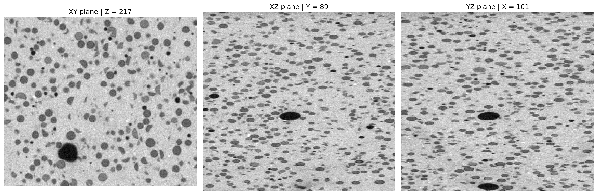
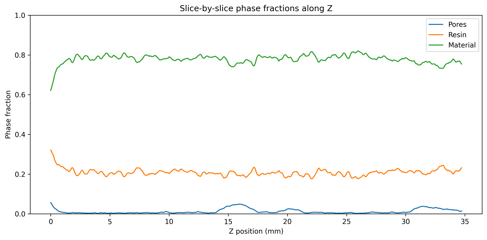
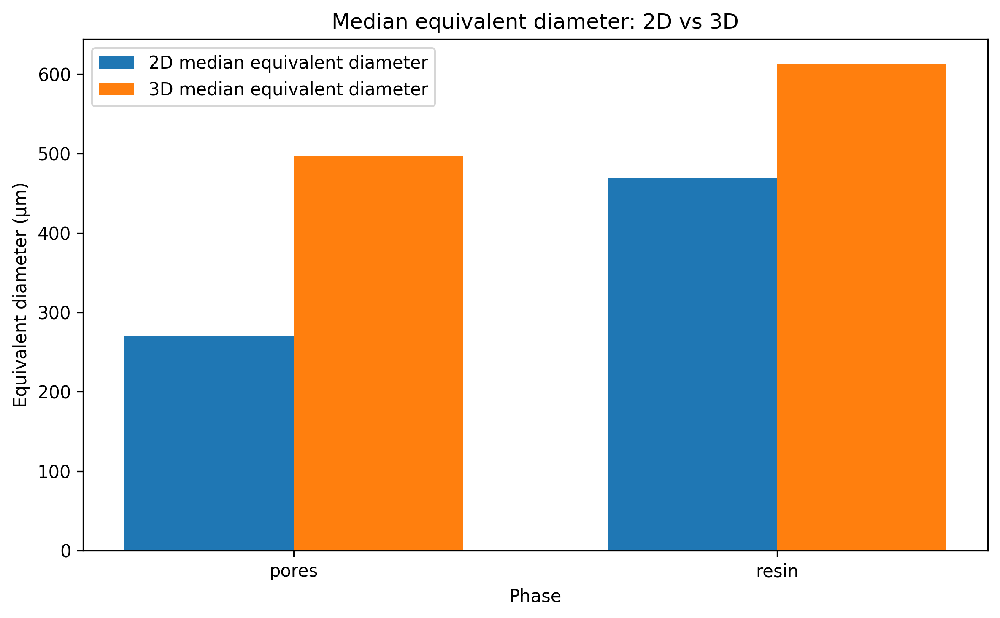
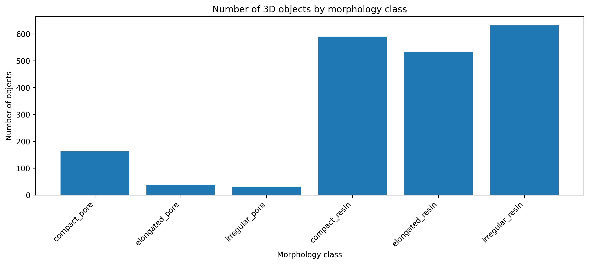
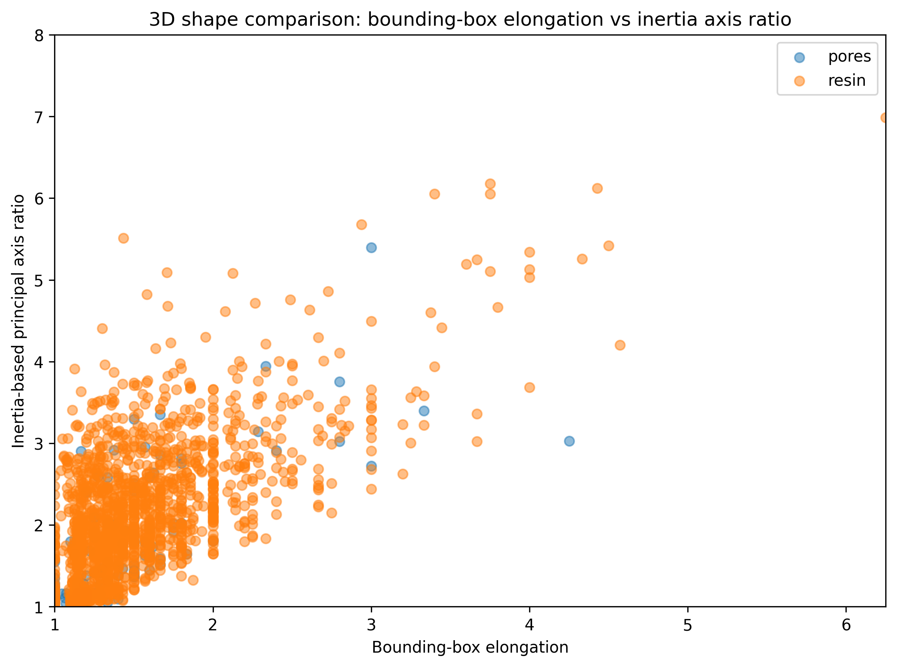
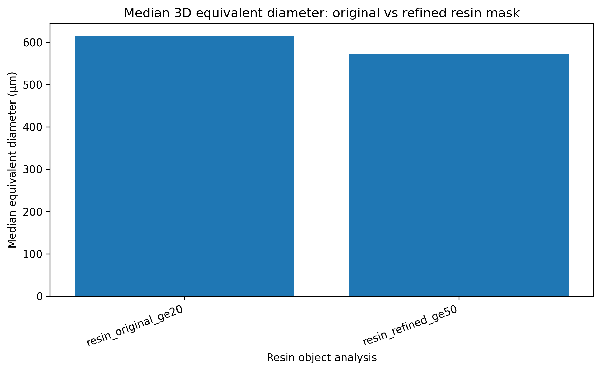

# 3D MicroCT Subvolume Analysis for Quantitative Porosity and Resin Characterization

This project analyzes a real 3D microCT subvolume extracted from a mortar sample.  
The goal is to move from 2D slice-based image analysis to true 3D quantitative measurements, including phase fractions, connected-component analysis, object morphology, and methodological comparison between 2D and 3D measurements.

The analysis focuses on three intensity-based phases:

- **Pores**
- **Resin-like regions**
- **Cementitious material / matrix**

This project extends the previous 2D mortar porosity analysis by processing a full cropped microCT stack and extracting volumetric descriptors from hundreds of consecutive slices.

---

## Project overview

The input data consist of a cropped 3D microCT subvolume:

```text
Volume shape: 435 × 178 × 202 voxels
Axis order: Z, Y, X
Voxel size: 80 µm
Data type: 8-bit grayscale TIFF stack
```

The analyzed subvolume corresponds to an internal region of a larger cylindrical mortar sample.  
The reduced size makes the dataset lightweight enough for local processing while preserving real 3D microstructural information.

---

## Main objectives

The project was designed to answer the following questions:

1. Can a real microCT subvolume be segmented into meaningful phases?
2. How stable are the phase fractions along the depth of the sample?
3. How different are 2D slice-by-slice measurements from true 3D connected-component measurements?
4. Can pores and resin-like regions be characterized by size, intensity, shape, and spatial descriptors?
5. How reliable are object-level resin measurements after filtering small fragmented components?

---

## Repository structure

```text
02_microct_subvolume_3d_analysis/
│
├── data/
│   └── raw/
│       └── DatosSubV/
│
├── figures/
│
├── notebooks/
│   └── 01_3d_microct_subvolume_region_statistics_and_classification.ipynb
│
├── results/
│
├── requirements.txt
└── README.md
```

---

## Workflow

The notebook follows a complete quantitative image-analysis pipeline:

```text
1. Load the microCT TIFF stack
2. Inspect representative slices
3. Visualize orthogonal views: XY, XZ, YZ
4. Analyze intensity statistics and histograms
5. Segment the volume into pores, resin-like regions, and material
6. Compute global and slice-by-slice phase fractions
7. Analyze 2D connected components slice by slice
8. Extract 2D descriptors: area, diameter, circularity, aspect ratio, intensity
9. Analyze 3D connected components
10. Extract 3D descriptors: volume, equivalent diameter, centroid, elongation, extent
11. Compare 2D and 3D measurements
12. Add inertia-based 3D shape descriptors
13. Refine resin object-level analysis by removing small fragmented components
14. Export quantitative tables and figures
```

---

## Phase segmentation

The 8-bit grayscale volume was segmented using intensity thresholds selected from histogram inspection and visual validation.

```text
Pores:              0–88
Resin-like regions: 89–169
Material / matrix:  170–255
```

This segmentation was used to compute phase fractions and object-level descriptors.

---

## Representative views

The volume was inspected using orthogonal slices in the XY, XZ, and YZ planes.



These views are important because some objects that appear rounded in a single 2D slice may extend or connect across the Z direction.

---

## Phase fractions

The global phase fractions were:

| Phase | Volume fraction |
|---|---:|
| Pores | ~1.23% |
| Resin-like regions | ~20.88% |
| Material / matrix | ~77.90% |

The phase fractions were also computed slice by slice along the Z direction.



The resin-like and material fractions remain relatively stable along the depth of the subvolume.  
The pore fraction shows stronger relative variability, mainly because pores occupy a much smaller total volume.

---

## 2D slice-by-slice connected-component analysis

Each slice was analyzed independently. For each 2D connected component, the following descriptors were computed:

- Area
- Equivalent diameter
- Perimeter-based circularity
- Eccentricity
- Aspect ratio
- Solidity
- Centroid position
- Mean intensity

This approach is useful for slice-based measurements, but it treats each cross-section as an independent object.

| Phase | Number of 2D objects | Median equivalent diameter |
|---|---:|---:|
| Pores | 5,280 | ~271 µm |
| Resin-like regions | 86,333 | ~469 µm |

The very large number of 2D resin-like regions reflects the fact that a single 3D object can appear across multiple slices, and that small fragmented regions may be counted independently in 2D.

---

## 3D connected-component analysis

The 3D analysis labels connected voxels across the full volume. This gives a more physical representation of volumetric objects.

| Phase | Number of 3D objects | Median equivalent diameter |
|---|---:|---:|
| Pores | 232 | ~496 µm |
| Resin-like connected regions | 1,757 | ~613 µm |

The difference between 2D and 3D measurements is expected: 2D analysis measures cross-sections, while 3D analysis measures connected volumetric regions.


---

## 2D vs 3D size comparison

The median equivalent diameter is larger in 3D because volumetric objects are reconstructed from multiple connected cross-sections.



This comparison illustrates an important point in microCT analysis:

> A 2D slice measures a cross-section, while a 3D connected-component analysis measures the full object volume.

---

## 3D morphology analysis

For each 3D object, the notebook computes:

- Volume
- Equivalent spherical diameter
- 3D centroid
- Bounding-box dimensions
- Bounding-box elongation
- 3D extent
- Mean intensity

A first morphology classification separates objects into compact, elongated, and irregular classes.



---

## Inertia-based shape descriptors

Bounding-box elongation is simple and interpretable, but it can produce discrete values because bounding-box dimensions are integer voxel lengths.  
To improve the shape analysis, the project also computes inertia-based descriptors using the spatial distribution of voxels inside each object.

The key descriptor is:

```text
inertia-based principal axis ratio = major principal axis / minor principal axis
```

This provides a smoother estimate of 3D elongation.



The comparison shows that bounding-box metrics introduce visible discretization, while inertia-based descriptors provide a more continuous description of object shape.

---

## Resin object-level refinement

The raw resin-like mask contains many small connected components. These can arise from local texture, partial-volume effects, boundary voxels, or small fragmented regions.

A size-based refinement was applied for object-level resin analysis:

```text
Minimum resin component size: 50 connected voxels
```

This refinement produced:

```text
Original raw resin components: 14,856
Refined resin components: 2,097
Resin-labeled volume preserved: ~98.05%
```

This step removes small fragmented components while preserving nearly all of the resin-like volume.

Final refined resin object-level measurements:

| Metric | Value |
|---|---:|
| Number of refined resin-like objects | 2,097 |
| Median equivalent diameter | ~571.6 µm |
| Mean equivalent diameter | ~639.0 µm |
| Resin-labeled volume preserved | ~98.05% |



A watershed-based separation of large resin-like regions was tested, but it was not adopted as the final method because it produced oversegmentation and did not improve the equivalent diameter estimate.  
The final resin object-level analysis therefore uses refined connected components rather than watershed-separated regions.

---

## Key results

| Quantity | Result |
|---|---:|
| Volume size | 435 × 178 × 202 voxels |
| Voxel size | 80 µm |
| Pore volume fraction | ~1.23% |
| Resin-like volume fraction | ~20.88% |
| Material volume fraction | ~77.90% |
| 2D pore objects | 5,280 |
| 3D pore objects | 232 |
| 2D resin-like objects | 86,333 |
| 3D resin-like connected regions | 1,757 |
| Refined 3D resin-like objects | 2,097 |
| Refined resin median diameter | ~571.6 µm |

---

## Main interpretation

This project shows why 3D microCT analysis cannot be reduced to independent 2D slice measurements.

2D analysis is useful for cross-sectional measurements, but it can overcount objects because the same 3D structure appears in many slices.  
3D connected-component analysis provides volumetric measurements, centroids, and object-level morphology, but it also requires careful interpretation when segmented regions are fragmented or partially connected.

For pores, 3D connected components provide meaningful volumetric descriptors.  
For resin-like regions, object-level interpretation requires filtering small fragmented components. A minimum-size filter of 50 voxels produced a stable and physically interpretable resin object population while preserving nearly all of the segmented resin volume.

---

## Skills demonstrated

This project demonstrates:

- 3D microCT stack loading and handling
- Scientific image segmentation
- Phase-fraction quantification
- Slice-by-slice statistics
- 2D connected-component analysis
- 3D connected-component analysis
- Morphological feature extraction
- Object centroid computation
- Intensity-based and morphology-based descriptors
- 2D vs 3D measurement comparison
- Inertia-based 3D shape analysis
- Method validation and refinement
- Export of reproducible quantitative tables and figures

---

## Technologies used

- Python
- NumPy
- Pandas
- Matplotlib
- SciPy
- scikit-image
- Jupyter Notebook

---

## Notebook

Main notebook:

```text
notebooks/01_3d_microct_subvolume_region_statistics_and_classification.ipynb
```

---

## Notes

The raw microCT data are real experimental data.  
The analysis is focused on quantitative scientific image processing rather than deep learning.  
The project is designed as a bridge between classical computer vision, microCT image analysis, and volumetric scientific measurement.
