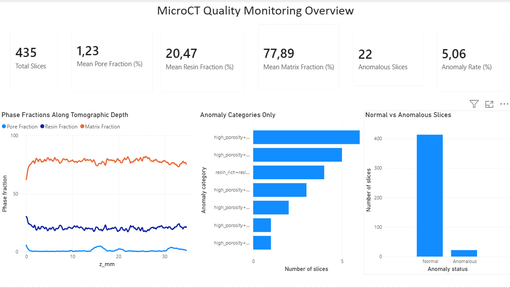
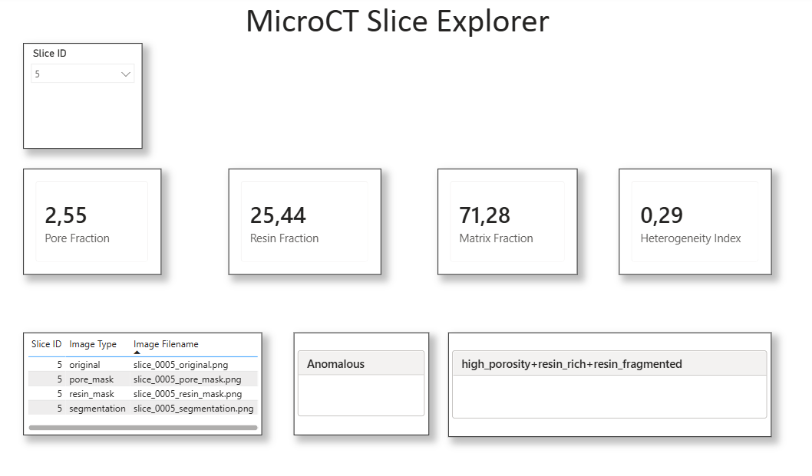

# MicroCT Quality Monitoring Dashboard with Power BI

**From 3D tomography segmentation to SQL-based reporting and interactive BI dashboards**

This project converts real 3D microCT analysis outputs into a compact Power BI dashboard for quality monitoring, slice-level exploration, and technical reporting.

It reuses the segmentation and anomaly-detection results generated in previous portfolio projects:

- **Project 02:** 3D microCT subvolume segmentation and 2D/3D object analysis.
- **Project 03:** slice-wise feature extraction and anomaly detection for process monitoring.

The goal is to demonstrate how scientific image-analysis outputs can be transformed into a structured reporting layer using **Python, SQL, and Power BI**.

---

## Motivation

MicroCT datasets are rich but difficult to communicate directly in a business or operational context. A raw 3D volume or segmentation mask is not enough for quality monitoring: results need to be summarized as indicators, trends, categories, and interpretable views.

This project builds a dashboard-oriented workflow that transforms tomography-derived measurements into:

- phase-fraction indicators,
- slice-wise quality metrics,
- anomaly summaries,
- representative slice exploration,
- SQL-ready reporting tables,
- Power BI visual dashboards.

The project is designed as a portfolio example for roles involving **Data Analysis, Business Intelligence, Applied Machine Learning, Scientific Data Analysis, Computer Vision, and quality monitoring of complex data**.

---

## Dataset

The project uses a real microCT subvolume of a cementitious material containing resin-like regions and pores.

The original analysis was performed in previous projects using:

- a reconstructed 3D microCT stack,
- 3-class phase segmentation,
- pore and resin masks,
- 2D and 3D connected-component analysis,
- slice-wise feature extraction,
- PCA and Isolation Forest anomaly detection.

The segmented phases are:

| Label | Phase |
|---|---|
| 0 | Pores |
| 1 | Resin-like regions |
| 2 | Matrix |

The working volume contains **435 tomographic slices**, with a voxel size of **80 µm**.

---

## Project Objective

The objective of this project is to create a reproducible reporting workflow:

```text
3D microCT analysis outputs
        ↓
Python dashboard-ready tables
        ↓
SQLite reporting database
        ↓
Power BI dashboard
        ↓
Portfolio-ready technical reporting
```

The final dashboard has two pages:

1. **MicroCT Quality Monitoring Overview**
2. **MicroCT Slice Explorer**

---

## Workflow

### 1. Prepare Power BI tables

Notebook:

```text
notebooks/01_prepare_powerbi_tables.ipynb
```

This notebook loads outputs from Projects 02 and 03 and prepares clean tables for Power BI:

- `dim_slice.csv`
- `fact_slice_features.csv`
- `fact_anomaly_results.csv`
- `summary_anomaly_categories.csv`
- `summary_phase_fractions.csv`
- `summary_2d_3d_objects.csv`

The resulting data model includes:

- slice depth information,
- phase fractions,
- intensity statistics,
- pore and resin object metrics,
- anomaly scores,
- anomaly categories,
- 2D vs 3D object comparison summaries.

---

### 2. Export representative slice images

Notebook:

```text
notebooks/02_export_slice_images_for_dashboard.ipynb
```

This notebook exports representative PNG images for selected slices.

For each selected slice, four image types are exported:

- original tomographic slice,
- 3-class segmentation map,
- pore mask,
- refined resin mask.

A total of **26 representative slices** were selected, producing **104 PNG files**.

The selected slices include:

```text
0, 1, 2, 3, 4, 5, 6, 7, 8, 9,
43, 130,
194, 196, 197, 198, 199, 200, 201, 202,
217, 304, 391, 414, 415, 434
```

The image index is stored in:

```text
data/dashboard_exports/image_index.csv
```

---

### 3. Create SQLite reporting database

Notebook:

```text
notebooks/03_create_sql_database.ipynb
```

This notebook creates a lightweight SQLite database from the dashboard-ready tables:

```text
data/sqlite/microct_quality_monitoring.db
```

It also exports SQL documentation:

```text
sql/create_tables.sql
sql/example_queries.sql
```

The database contains:

- `dim_slice`
- `fact_slice_features`
- `fact_anomaly_results`
- `summary_anomaly_categories`
- `summary_phase_fractions`
- `summary_2d_3d_objects`
- `image_index`

---

### 4. Build Power BI dashboard

Power BI file:

```text
powerbi/microct_quality_monitoring_dashboard.pbix
```

The dashboard was built in Power BI Desktop using the cleaned Excel input generated from the CSV exports.

Main Power BI input:

```text
data/dashboard_exports/microct_powerbi_input.xlsx
```

A corrected Excel version was also generated to support a stable slice explorer page:

```text
data/dashboard_exports/microct_powerbi_input_corrected.xlsx
```

The corrected file includes a simplified table:

```text
slice_explorer_summary
```

This table contains one row per representative slice and is used to avoid filtering issues caused by multiple image records per slice.

---

## Power BI Dashboard

### Page 1 — MicroCT Quality Monitoring Overview

This page summarizes the global behavior of the analyzed microCT volume.

It includes:

- total number of slices,
- mean pore fraction,
- mean resin-like fraction,
- mean matrix fraction,
- number of anomalous slices,
- anomaly rate,
- phase fractions along tomographic depth,
- normal vs anomalous slice count,
- anomaly category summary.



---

### Page 2 — MicroCT Slice Explorer

This page allows exploration of selected representative slices.

It includes:

- selected slice ID,
- pore fraction,
- resin-like fraction,
- matrix fraction,
- heterogeneity index,
- anomaly status,
- anomaly category,
- available image files for the selected slice.

The slice explorer uses the `slice_explorer_summary` table, which contains one row per selected slice for stable filtering in Power BI.



---

## Key Results

The dashboard summarizes the microCT volume as follows:

| Metric | Value |
|---|---:|
| Total slices | 435 |
| Mean pore fraction | ~1.23% |
| Mean resin-like fraction | ~20.47% |
| Mean matrix fraction | ~77.89% |
| Anomalous slices | 22 |
| Anomaly rate | ~5.06% |

The anomaly detection results identify a small subset of slices with deviations related to:

- high porosity,
- resin-rich regions,
- resin fragmentation,
- large pores,
- combined structural deviations.

The selected slice explorer provides a compact way to inspect representative slices together with their quantitative metrics.

---

## Repository Structure

```text
05_microct_quality_monitoring_powerbi/
├── README.md
├── requirements.txt
│
├── data/
│   ├── dashboard_exports/
│   │   ├── dim_slice.csv
│   │   ├── fact_slice_features.csv
│   │   ├── fact_anomaly_results.csv
│   │   ├── summary_anomaly_categories.csv
│   │   ├── summary_phase_fractions.csv
│   │   ├── summary_2d_3d_objects.csv
│   │   ├── image_index.csv
│   │   ├── microct_powerbi_input.xlsx
│   │   ├── microct_powerbi_input_corrected.xlsx
│   │   └── slice_images/
│   │       └── selected_slices/
│   │
│   └── sqlite/
│       └── microct_quality_monitoring.db
│
├── notebooks/
│   ├── 01_prepare_powerbi_tables.ipynb
│   ├── 02_export_slice_images_for_dashboard.ipynb
│   └── 03_create_sql_database.ipynb
│
├── powerbi/
│   └── microct_quality_monitoring_dashboard.pbix
│
├── sql/
│   ├── create_tables.sql
│   └── example_queries.sql
│
└── figures/
    ├── dashboard_01_overview.png
    └── dashboard_02_slice_explorer.png
```

---

## Tools Used

| Tool | Purpose |
|---|---|
| Python | Data preparation and image export |
| Pandas | Table cleaning and dashboard exports |
| NumPy | Array handling |
| PIL / Pillow | PNG image generation |
| SQLite | Lightweight reporting database |
| SQL | Query examples and schema documentation |
| Power BI Desktop | Dashboard creation |
| DAX | KPI and dashboard measures |
| Jupyter Notebook | Reproducible workflow |

---

## What This Project Demonstrates

This project demonstrates the ability to:

- transform scientific image-analysis outputs into BI-ready tables,
- design a simple reporting data model,
- integrate Python, SQL, and Power BI in a reproducible workflow,
- build interactive dashboards from real microCT-derived measurements,
- communicate complex 3D imaging results as business-friendly indicators,
- connect anomaly detection outputs with interpretable monitoring dashboards.

The project is not only a Power BI exercise. It shows how a scientific image-processing pipeline can be converted into a dashboard-oriented workflow suitable for technical reporting, quality control, and applied analytics.

---

## Limitations

The dashboard is intentionally compact and portfolio-oriented.

Current limitations:

- the slice explorer uses **26 representative slices**, not the full set of 435 slices;
- image rendering in Power BI was simplified to keep the dashboard lightweight;
- Power BI is used as the reporting layer, while segmentation and anomaly detection are performed in Python;
- the dashboard is designed for local use with the included `.pbix` file and exported data tables.

---

## Possible Future Improvements

Possible extensions include:

- exporting images for all 435 slices,
- integrating dynamic image rendering through web-hosted image paths,
- adding a dedicated PCA/anomaly analysis page,
- adding 2D vs 3D object comparison visuals,
- connecting Power BI directly to the SQLite database,
- publishing the report through Power BI Service,
- adding automated refresh from the Python pipeline.

---

## Portfolio Summary

This project shows how real 3D microCT analysis results can be transformed into a complete reporting workflow:

```text
Python for scientific image analysis
SQL for structured reporting
Power BI for interactive communication
```

It provides a compact example of applied analytics for complex scientific imaging data, with direct relevance to quality monitoring, industrial inspection, materials analysis, and technical reporting.
