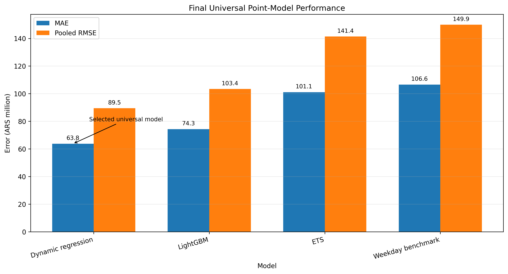
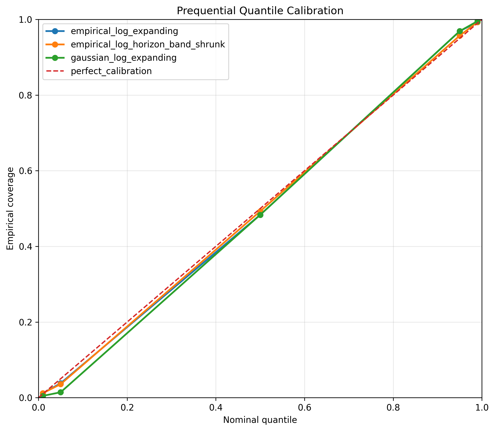
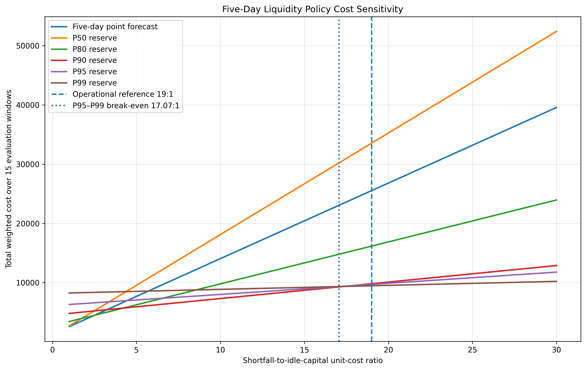
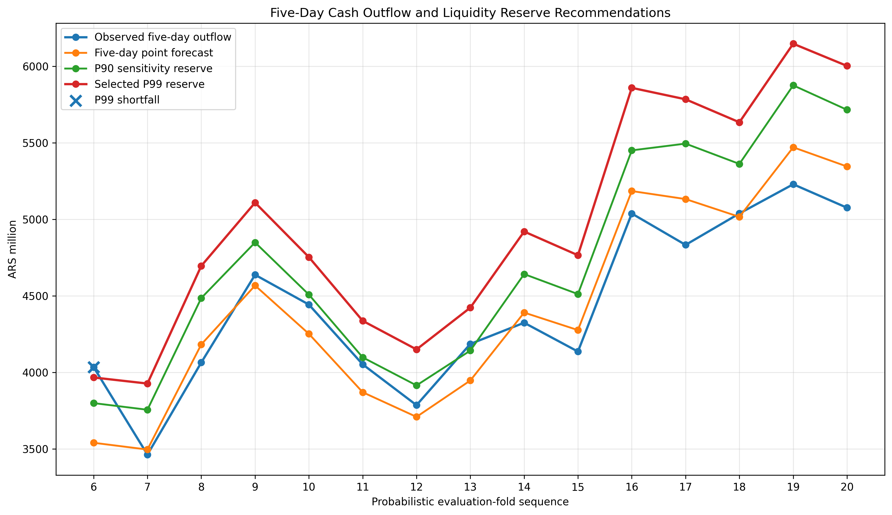

# Fintech Liquidity Forecasting and Reserve Optimization

## Overview

This project develops an end-to-end liquidity forecasting framework for a simulated Fintech. The objective is not only to predict future cash outflows, but to translate forecast uncertainty into an operational reserve decision for treasury.

The workflow combines:

- reproducible synthetic daily transaction data;
- time-series exploration and diagnostics;
- statistical and machine-learning forecasting models;
- rolling-origin backtesting;
- calibrated probabilistic forecasts;
- five-day cumulative liquidity-risk simulation;
- cost-sensitive reserve optimization;
- dashboard-ready outputs and audit artifacts.

The central business question is:

> **How much liquidity should the Fintech hold over its operational funding horizon to minimize shortfall risk and idle capital costs?**

The final system uses a dynamic-regression model for point forecasting, empirical out-of-sample errors for daily probabilistic calibration, and a moving-block bootstrap for five-day cumulative liquidity risk.

---

## Business Problem

A Fintech must hold enough liquidity to cover withdrawals and outgoing transfers while avoiding excessive idle capital.

The reserve decision balances two asymmetric costs:

$$
C =
c_u \max(Y-R,0)
+
c_o \max(R-Y,0)
$$

where:

- $Y$ is the observed cash outflow;
- $R$ is the selected liquidity reserve;
- $c_u$ is the unit cost of a liquidity shortfall;
- $c_o$ is the unit cost of excess reserve.

The theoretical cost-optimal quantile is:

$$
q^* = \frac{c_u}{c_u+c_o}
$$

The project evaluates this decision explicitly rather than selecting a reserve quantile arbitrarily.

---

## Dataset

The project uses a reproducible synthetic daily Fintech dataset designed to capture realistic operational and macroeconomic behavior.

| Item | Value |
|---|---:|
| Date range | 2023-01-01 to 2026-07-31 |
| Observations | 1,308 daily rows |
| Variables | 39 |
| Primary target | `total_cash_outflow` |
| Unit | ARS million |
| Forecast horizon | 28 days |
| Funding lead time | 5 days |

The target is defined as:

```text
total_cash_outflow =
withdrawal_amount + outgoing_transfer_amount
```

The data include:

- withdrawals and outgoing transfers;
- transaction counts and ticket sizes;
- active users and balances;
- weekly and calendar effects;
- payday and month-end effects;
- holidays;
- promotions;
- merchant settlements;
- system incidents;
- simulated macroeconomic variables and shocks.

All data are synthetic and do not represent a real company.

---

## Project Workflow

The project is organized into eight notebooks.

| Notebook | Purpose |
|---|---|
| `01_business_problem_and_data_generation.ipynb` | Business framing and reproducible synthetic-data generation |
| `02_time_series_eda.ipynb` | Time-series exploration, seasonality, events, and statistical diagnostics |
| `03_baselines_and_ets.ipynb` | Simple benchmarks and ETS modeling |
| `04_dynamic_regression_and_sarimax.ipynb` | Dynamic regression with calendar and promotion effects plus ARIMA errors |
| `05_lightgbm_feature_engineering.ipynb` | Leakage-safe feature engineering and LightGBM challenger |
| `06_rolling_origin_backtesting.ipynb` | Homogeneous all-model comparison and final point-model selection |
| `07_probabilistic_forecasting_and_liquidity_policy.ipynb` | Probabilistic calibration, five-day uncertainty, and reserve policy |
| `08_dashboard_data_and_final_results.ipynb` | Dashboard datasets, final business results, reproducibility, and project closure |

---

## Validation Strategy

All forecasting comparisons use temporal validation.

### Rolling-origin backtesting

The common outer backtest is:

```text
Folds: 20
Forecast horizon: 28 days
Step: 28 days
Training window: expanding
Predictions per model: 560
```

Random train/test splitting is prohibited.

All comparable models are evaluated on the same target dates, folds, forecast horizons, and observed values.

### Leakage controls

The project applies explicit leakage safeguards:

- training always precedes validation and test periods;
- rolling features exclude the current target;
- future exogenous variables are used only when operationally available;
- preprocessing and feature construction are fold-safe;
- LightGBM hyperparameter development is separated from the outer backtest;
- probabilistic calibration uses prior out-of-sample errors only.

---

## Point-Forecast Model Comparison

Five models were compared on the same 560 out-of-sample predictions.

| Model | Role | MAE | Pooled RMSE | Bias |
|---|---|---:|---:|---:|
| `calendar_promotion_settlement_trend_arima011_errors` | Conditional settlement variant | 60.45 | 79.52 | 0.57% |
| `calendar_promotion_trend_arima011_errors` | **Final universal model** | **63.75** | **89.47** | **0.49%** |
| `lightgbm_global_direct_relative_rolling56_l2` | ML challenger | 74.32 | 103.40 | 0.58% |
| `ets_log_damped_additive` | Statistical benchmark | 101.06 | 141.39 | -0.86% |
| `historical_weekday_average` | Simple benchmark | 106.58 | 149.94 | -3.80% |

The settlement-aware specification achieved the lowest descriptive error, but it was not selected as the universal model because only three settlement target dates were available out of sample and operational use would require a reliable future settlement schedule.

The final universal point model is therefore:

```text
calendar_promotion_trend_arima011_errors
```

It uses:

- log-transformed target;
- day-of-week effects;
- month-end effects;
- holidays;
- payday and payday-window indicators;
- promotion intensity;
- deterministic time trend;
- ARIMA(0,1,1) errors;
- lognormal conditional-mean back-transformation.

Compared with the universal challengers, the selected model improved MAE by approximately:

- **14.2% vs LightGBM**
- **36.9% vs ETS**
- **40.2% vs the historical weekday benchmark**



---

## Probabilistic Forecasting

Residual diagnostics showed non-Gaussian tails, so uncertainty estimation did not rely exclusively on uncalibrated Gaussian intervals.

Three daily probabilistic methods were evaluated:

- `gaussian_log_expanding`
- `empirical_log_expanding`
- `empirical_log_horizon_band_shrunk`

The selected method is:

```text
empirical_log_expanding
```

It uses expanding empirical distributions of previous out-of-sample log errors.

### Evaluation protocol

```text
Initial calibration folds: 5
Prequential evaluation folds: 15
Probabilistic evaluation rows: 420
Quantiles: P01, P05, P50, P95, P99
```

### Calibration results

| Metric | Result |
|---|---:|
| P50 empirical coverage | 48.33% |
| P95 empirical coverage | 96.90% |
| P99 empirical coverage | 99.29% |
| PI90 empirical coverage | 93.10% |
| PI98 empirical coverage | 98.10% |

Across all three evaluated methods, `empirical_log_expanding` achieved the lowest mean pinball loss on 15 of 28 horizons. Restricting the comparison to methods eligible for final selection, it won 19 of 28 horizons and all four weekly horizon bands.



---

## Five-Day Cumulative Liquidity Risk

The operational reserve horizon is five days, representing the assumed funding lead time.

The reserve is modeled from the joint future distribution:

$$
R_t =
Q_q \left(
\sum_{h=1}^{5} Y_{t+h}
\right)
$$

Daily P95 or P99 values are **not** simply summed, because doing so ignores dependence between consecutive days.

Two cumulative simulation approaches were compared:

- independent log-error bootstrap;
- moving-block log bootstrap.

The selected approach is:

```text
moving_block_log_bootstrap
```

It preserves short-range temporal dependence by resampling contiguous five-day blocks of prior out-of-sample log errors.

### Five-day evaluation

```text
Evaluation windows: 15
Simulations per fold: 20,000
P95 coverage: 93.33%
P99 coverage: 93.33%
P95 exceedances: 1
P99 exceedances: 1
```

Because only 15 cumulative windows are available, extreme service probabilities should not be interpreted as precisely estimated.

---

## Liquidity Reserve Policy

The reserve policy is evaluated under explicit shortfall-to-idle-capital cost ratios.

### Empirical policy regions

| Policy | Empirical winning cost-ratio region |
|---|---|
| Five-day point forecast | 1.0:1 to 2.5:1 |
| P80 reserve | 2.6:1 to 4.2:1 |
| P90 reserve | 4.3:1 to 17.3:1 |
| P99 reserve | 17.4:1 to 100:1 |

P95 is the theoretical quantile associated with a 19:1 cost ratio, but it did not become the empirical winner over the evaluated grid.

The estimated P95-P99 break-even ratio was:

```text
17.0653:1
```

Therefore, under the illustrative operating assumption:

```text
Shortfall cost : Idle-capital cost = 19 : 1
```

the selected reserve policy is:

```text
reserve_p99
```

The retained sensitivity policy is:

```text
reserve_p90
```



---

## Operational Results

Under the 19:1 scenario, the P99 policy produced the following results over 15 five-day evaluation windows.

| Metric | Result |
|---|---:|
| Mean observed five-day outflow | 4,422.47 ARS million |
| Mean five-day point forecast | 4,425.15 ARS million |
| Mean selected P99 reserve | **4,964.69 ARS million** |
| Mean increment over point forecast | **539.54 ARS million** |
| Successful windows | **14 / 15** |
| Observed service level | **93.33%** |
| Shortfall windows | **1** |
| Total shortfall | **67.39 ARS million** |
| Mean idle capital | **546.71 ARS million** |
| Scenario-based total weighted cost | **9,481.05 weighted cost units** |

The weighted cost is an analytical scenario metric, not an observed accounting cost.



---

## Final Business Recommendation

The recommended operating policy for the evaluated scenario is to hold the **P99 quantile of the simulated five-day cumulative cash-outflow distribution**.

This recommendation is conditional on the assumption that one unit of liquidity shortfall is approximately **19 times more costly** than one unit of idle capital.

The P99 policy is preferred because:

- it produced the lowest observed weighted cost under the 19:1 scenario;
- the estimated P95-P99 break-even ratio was approximately 17.07:1;
- P99 was preferred to P95 in 14 of 15 leave-one-window-out comparisons;
- P99 was the overall minimum-cost policy in 13 of 15 leave-one-window-out samples.

This does **not** mean that P99 is universally optimal or guarantees 99% service.

For lower shortfall-cost assumptions, P90 remains the main sensitivity alternative.

---

## Analyst-in-the-Loop Design

The operational output preserves a transparent separation between:

```text
model forecast
probabilistic reserve
analyst adjustment
adjustment reason
final reserve
observed outflow
```

No analyst adjustments were applied during backtesting.

This prevents manual decisions from introducing hidden future information and allows future production use to compare:

- pure model recommendations;
- analyst-adjusted recommendations;
- realized outcomes.

---

## Dashboard-Ready Outputs

Notebook 08 consolidates the final validated outputs into compact datasets:

```text
08_dashboard_five_day_liquidity.csv
08_dashboard_final_operational_kpis.csv
08_dashboard_model_performance.csv
08_dashboard_probabilistic_quantiles.csv
08_dashboard_probabilistic_intervals.csv
08_dashboard_policy_sensitivity.csv
08_dashboard_analyst_in_the_loop.csv
08_readme_ready_results.csv
```

These files are stored in:

```text
data/processed/
```

The final README figures are:

```text
figures/08_final_universal_model_comparison.png
figures/07_prequential_quantile_calibration.png
figures/07_liquidity_policy_cost_sensitivity.png
figures/07_five_day_operational_liquidity_recommendations.png
```

---

## Repository Structure

```text
06_fintech-liquidity-forecasting/
│
├── data/
│   ├── raw/
│   ├── processed/
│   └── external/
│
├── notebooks/
│   ├── 01_business_problem_and_data_generation.ipynb
│   ├── 02_time_series_eda.ipynb
│   ├── 03_baselines_and_ets.ipynb
│   ├── 04_dynamic_regression_and_sarimax.ipynb
│   ├── 05_lightgbm_feature_engineering.ipynb
│   ├── 06_rolling_origin_backtesting.ipynb
│   ├── 07_probabilistic_forecasting_and_liquidity_policy.ipynb
│   └── 08_dashboard_data_and_final_results.ipynb
│
├── src/
├── figures/
├── models/
├── dashboard/
├── requirements.txt
└── README.md
```

---

## Reproducibility

The repository was audited at project closure.

Final structural checks confirmed:

```text
8 notebooks present
8 notebooks readable
all notebooks non-empty
raw-data directory present
processed-data directory present
figures directory present
dashboard directory present
requirements.txt present and populated
README.md present
```

The validated environment is documented in `requirements.txt`:

```text
holidays==0.101
ipython==9.10.0
lightgbm==4.7.0
matplotlib==3.10.8
numpy==2.4.2
pandas==3.0.1
scipy==1.17.1
shap==0.51.0
statsmodels==0.14.6
```

---

## Limitations

The project is intentionally scoped as a portfolio-grade analytical system rather than a production treasury platform.

Key limitations include:

- **Synthetic data:** results do not represent a real financial institution.
- **Limited five-day sample:** only 15 cumulative evaluation windows are available.
- **Illustrative cost ratio:** the 19:1 ratio is a scenario assumption, not an institution-specific estimate.
- **Single aggregated target:** withdrawals and transfers are modeled together.
- **Daily frequency:** intraday liquidity dynamics are outside scope.
- **Known future inputs:** the final model requires calendar and planned promotion information.
- **Conditional settlement model:** settlement-aware results have only three supported out-of-sample settlement dates.
- **Simplified reserve optimization:** regulatory constraints, credit facilities, funding instruments, and balance-sheet mechanics are not modeled.
- **No analyst overrides in backtesting:** human adjustments remain a future operational extension.

---

## Future Improvements

A production-oriented extension could include:

- real transactional and treasury data;
- longer probabilistic backtesting history;
- institution-specific shortfall and idle-capital cost estimation;
- separate forecasts for withdrawals and transfer components;
- customer, currency, or regional segmentation;
- intraday forecasting;
- scenario modeling for uncertain promotions and settlements;
- available-liquidity and credit-facility constraints;
- regulatory liquidity requirements;
- funding-instrument optimization;
- calibration-drift monitoring;
- prospective evaluation of analyst overrides.

---

## What This Project Demonstrates

This project demonstrates the ability to:

- formulate a forecasting problem from a treasury decision;
- generate and document realistic synthetic data;
- perform time-series diagnostics and feature analysis;
- implement statistical and machine-learning forecasting models;
- enforce temporal validation and leakage controls;
- compare models under a homogeneous rolling-origin framework;
- quantify predictive uncertainty using out-of-sample calibration;
- preserve temporal dependence in multi-day risk simulation;
- connect predictive distributions to asymmetric business costs;
- build an auditable liquidity reserve policy;
- consolidate technical outputs into portfolio-ready business results.

The core lesson is that **forecast accuracy alone is not sufficient for liquidity management**. A useful treasury system must combine point forecasts, calibrated uncertainty, operational constraints, and asymmetric business costs.

---

## Final Project Status

```text
Notebooks 01-08: VALIDATED AND CLOSED
Final point model: calendar_promotion_trend_arima011_errors
Daily probabilistic method: empirical_log_expanding
Five-day joint method: moving_block_log_bootstrap
Selected reserve policy under 19:1: reserve_p99
Sensitivity policy: reserve_p90
Repository readiness: PASSED
Dependencies: DOCUMENTED
Dashboard datasets: READY
Project delivery: COMPLETE
```
